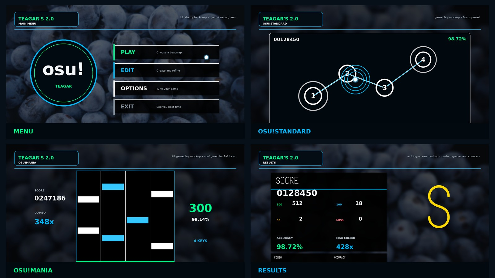
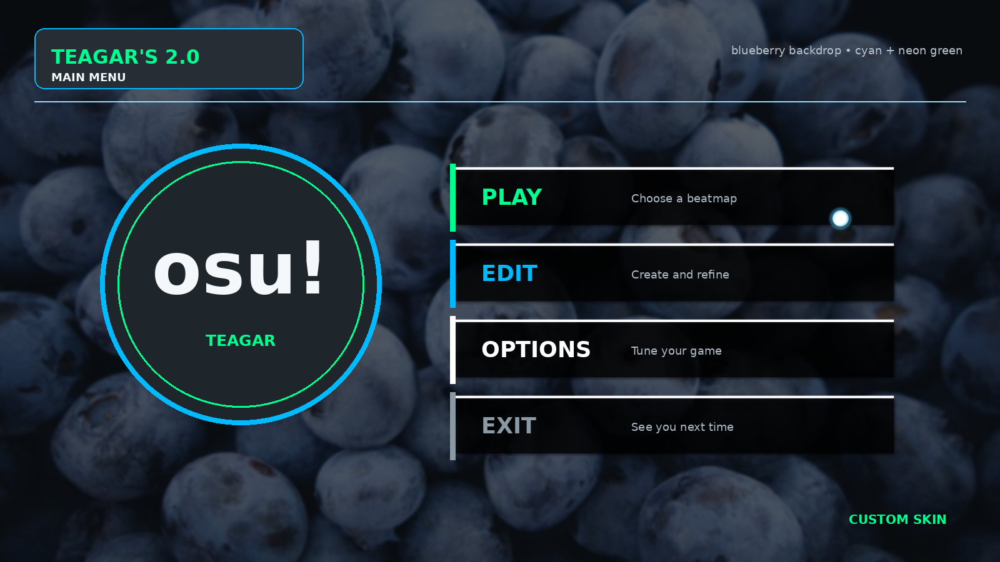
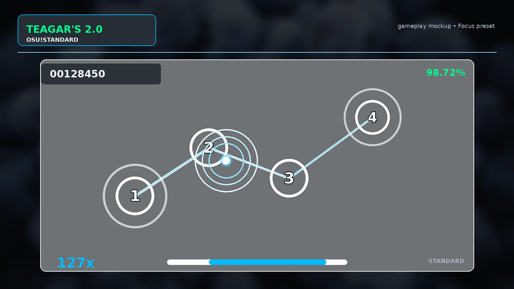
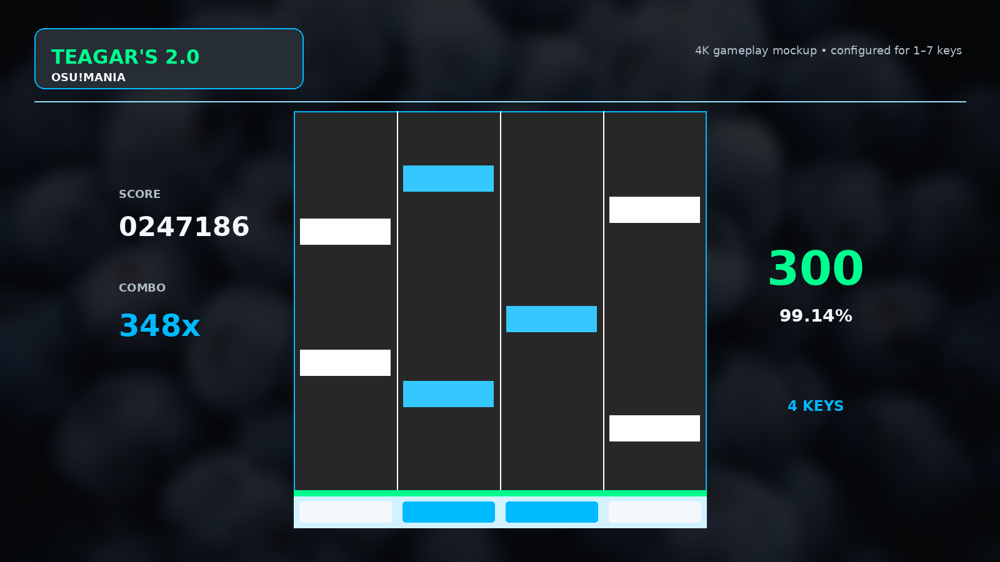
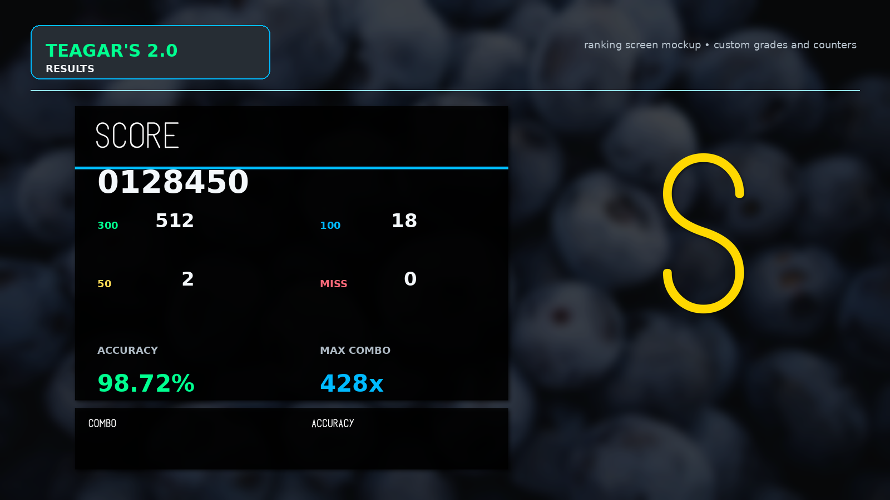

# Teagar's 2.0

My personal custom skin for [osu!](https://osu.ppy.sh/), with assets and configurations for osu!standard and osu!mania.



## Preview

The images below are presentation mockups composed from the actual assets included in the skin.

| Main menu | osu!standard |
|:---:|:---:|
|  |  |

| osu!mania | Results |
|:---:|:---:|
|  |  |

## Installation

1. Download `Teagars-2.0.osk` from the [latest release](https://github.com/Teagar/teagar-osu-skin/releases/latest).
2. Open the downloaded file with osu!.
3. Select **Teagar's 2.0 [Teagar]** in the skin settings.

## Manual installation

Clone or download this repository and copy its contents into a folder under the osu! `Skins` directory.

## Details

- Creator: Teagar
- Skin name: Teagar's 2.0
- Primary colour: `#00BAFF`
- Accent colour: `#00FF90`

## Regenerating the showcase

The preview images can be regenerated with Pillow:

```bash
python tools/generate_previews.py
```
